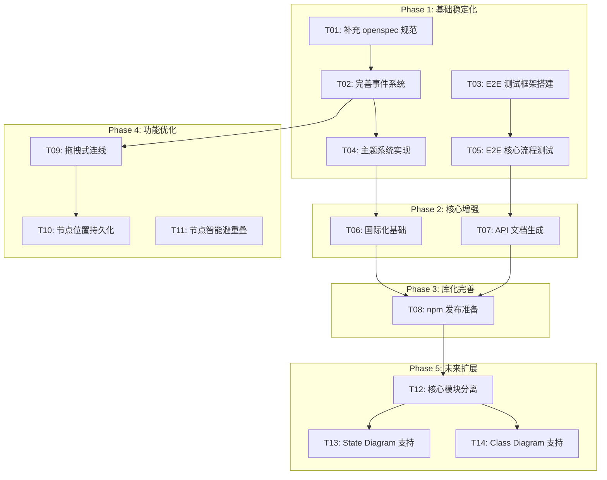

# Merfolk Editor 开发规划

> 版本: v0.2.x 路线图
> 生成日期: 2026-01-22
> 基于代码分析自动生成

---

## 1. Project Snapshot（项目现状快照）

### 1.1 已实现功能

- **Flowchart 完整语法支持**: 支持 Mermaid v11.12.2 的 30+ 节点形状、高级边语法（隐形边、多节点链接、边长度、边 ID、动画）、子图嵌套和方向控制。证据: `docs/plan/FRs/FR-00-总览.md` 显示 FR-01 到 FR-10 全部标记为 ✅ 完成。

- **核心架构成熟**: 采用三层分离架构 —— `src/core/`（模型/解析器/序列化器/命令系统）、`src/canvas/`（D3 渲染/布局/选择/拖拽）、`src/components/`（Svelte UI）。证据: `src/core/index.ts` 导出 `model`、`parser`、`serializer`、`command` 四大模块。

- **命令系统与撤销/重做**: 实现了完整的 Command 模式，支持 50 步历史栈。证据: `src/core/command/commands/` 下有 7 个具体命令类（AddNodeCommand、DeleteNodeCommand 等）。

- **测试覆盖良好**: 300 个单元测试全部通过，涵盖 13 个测试文件。证据: `pnpm test` 输出显示 `300 passed`，覆盖 Parser、Serializer、Model、SyncEngine、Canvas 等模块。

- **TypeScript 类型安全**: 严格模式下 0 错误 0 警告。证据: `pnpm check` 输出 `svelte-check found 0 errors and 0 warnings`。

- **库化基础完成**: 提供 ESM/CJS/IIFE 三种格式，支持 Svelte 组件和 Vanilla JS 两种使用方式。证据: `package.json` 的 `exports` 字段定义了三种入口，`src/lib/index.ts` 导出 `MerfolkEditor` 类和核心模块。

- **CI/CD 基础设施**: GitHub Actions 配置了 release 和 docker-publish 两个工作流。证据: `.github/workflows/release.yml` 和 `docker-publish.yml`。

### 1.2 技术债务与缺口

- **E2E 测试缺失**: 仅有 placeholder 测试 `e2e/template.spec.ts`（被 skip）。证据: 文件内容为 `test.skip('placeholder e2e', ...)`。

- **openspec 规范未初始化**: `openspec/project.md` 仅有模板占位符，未填充实际项目信息。

- **拖拽式连线未完全实现**: 当前添加边需要通过对话框选择，而非拖拽式创建。证据: `docs/plan/issues.md` 明确列为待解决问题。

- **节点位置仅内存存储**: 拖拽位置未持久化到 localStorage 或文件。证据: `docs/plan/issues.md` 技术债务第 2 条。

- **缺少事件系统**: 库 API 缺乏统一的 `on/off/emit` 事件机制。证据: `docs/LIBRARY_INTEGRATION_PLAN.md` Phase 1 任务列表。

- **缺少主题系统**: 无 CSS 变量和主题切换能力。证据: `docs/LIBRARY_INTEGRATION_PLAN.md` Phase 1 任务列表。

- **缺少国际化**: 所有 UI 文本硬编码，虽有 `EditorStrings` 接口但未实际使用。证据: `src/lib/types.ts` 定义了 `EditorStrings` 但组件中硬编码字符串。

---

## 2. Assumptions & Open Questions（假设与待确认问题）

### 2.1 假设

| # | 假设内容 | 依据 |
|---|----------|------|
| A1 | 短期目标是 v0.2.0 稳定版发布 | README 显示当前为 v0.1.0，无 npm 发布 |
| A2 | 优先级：稳定性 > 新功能 > 生态扩展 | 已完成功能较多但测试/文档不足 |
| A3 | 目标用户为开发者（嵌入使用） | README 详细描述了 VSCode/Obsidian 集成 |
| A4 | 暂不支持其他 Mermaid 图类型 | FR-00 明确标注"暂不实现" |

### 2.2 待确认问题

| # | 问题 | 默认答案 | 替代路径 |
|---|------|----------|----------|
| Q1 | 是否需要发布到 npm？ | **是**，作为正式库分发 | 仅 GitHub Tag 分发，跳过 T08 |
| Q2 | VSCode 扩展是否需要在 v0.2 实现？ | **否**，推迟到 v0.3 | 提前到 v0.2，增加 T15 |
| Q3 | 是否需要 React/Vue 包装组件？ | **否**，v0.2 聚焦核心库 | 需要时增加 T16/T17 |
| Q4 | 测试覆盖率目标？ | **单元 85%+，E2E 核心流程 100%** | 可调整优先级 |
| Q5 | 是否需要支持 i18n？ | **是**，但仅中英文 | 仅英文，简化 T06 |

---

## 3. Dependency Graph（依赖关系图）



### 拓扑排序（执行顺序）

```
Level 0 (无依赖):     T01, T03, T11
Level 1 (依赖 L0):    T02, T05
Level 2 (依赖 L1):    T04, T07, T09
Level 3 (依赖 L2):    T06, T10
Level 4 (依赖 L3):    T08
Level 5 (依赖 L4):    T12
Level 6 (依赖 L5):    T13, T14
```

---

## 4. Task Details（任务详情）

### T01: 补充 openspec 规范

**范围**: 填充 `openspec/project.md` 模板，建立规范驱动开发基础

**涉及文件**:
- `openspec/project.md`

**验收标准**:
- [ ] 目的、技术栈、架构模式、测试策略、Git 工作流程完整描述
- [ ] 与 `CLAUDE.md`/`AGENTS.md` 内容一致

**测试要求**: 无（文档任务）

**风险**: 低

**回滚/兼容性**: 无影响

---

### T02: 完善事件系统

**范围**: 在 `MerfolkEditor` 类中实现统一的 `on/off/once/emit` 事件机制

**涉及文件**:
- `src/lib/index.ts`
- `src/lib/types.ts`
- `src/core/model/EventEmitter.ts`（已存在基础实现）

**验收标准**:
- [ ] 支持 `codeChange`, `selectionChange`, `nodeAdd`, `nodeRemove`, `edgeAdd`, `edgeRemove` 事件
- [ ] 事件回调类型安全
- [ ] 支持 `once` 一次性监听

**测试要求**:
- [ ] 单元测试覆盖所有事件类型
- [ ] 测试内存泄漏（移除监听器后无残留引用）

**风险**: 中（需要重构内部事件传递机制）

**回滚/兼容性**: 新增 API，不破坏现有 API

---

### T03: E2E 测试框架搭建

**范围**: 配置 Playwright 测试环境，编写基础测试 helper

**涉及文件**:
- `e2e/template.spec.ts` → 重命名为 `e2e/basic.spec.ts`
- `e2e/helpers/` (新增)
- `playwright.config.ts`

**验收标准**:
- [ ] `pnpm test:e2e` 可正常运行
- [ ] 提供 `createEditor()`, `getCanvasElement()`, `waitForRender()` 等 helper
- [ ] 至少 1 个真实测试用例通过

**测试要求**: 自身即测试任务

**风险**: 低

**回滚/兼容性**: 新增测试，无影响

---

### T04: 主题系统实现

**范围**: 实现 CSS 变量驱动的主题系统，支持 light/dark/auto

**涉及文件**:
- `src/lib/types.ts` (新增 ThemeConfig 类型)
- `src/lib/theme.ts` (新增)
- `src/components/*.svelte` (更新样式引用)
- `src/lib/index.ts` (新增 setTheme API)

**验收标准**:
- [ ] `editor.setTheme('light' | 'dark' | 'auto')` 工作正常
- [ ] CSS 变量覆盖所有颜色、尺寸定义
- [ ] 支持自定义主题对象

**测试要求**:
- [ ] E2E 测试主题切换
- [ ] 单元测试主题配置合并逻辑

**风险**: 中（需要审计所有硬编码颜色）

**回滚/兼容性**: 新增 API，默认行为不变

---

### T05: E2E 核心流程测试

**范围**: 编写覆盖核心用户流程的 E2E 测试

**涉及文件**:
- `e2e/node-operations.spec.ts` (新增)
- `e2e/edge-operations.spec.ts` (新增)
- `e2e/code-sync.spec.ts` (新增)
- `e2e/undo-redo.spec.ts` (新增)

**验收标准**:
- [ ] 节点：添加、编辑、删除、拖拽、多选
- [ ] 边：添加、编辑、删除
- [ ] 代码同步：画布 → 代码、代码 → 画布
- [ ] 撤销/重做：至少 5 步操作

**测试要求**: 自身即测试任务

**风险**: 中（UI 交互可能不稳定）

**回滚/兼容性**: 新增测试，无影响

---

### T06: 国际化基础

**范围**: 实现 i18n 机制，支持中英文切换

**涉及文件**:
- `src/lib/i18n/` (新增目录)
- `src/lib/i18n/zh-CN.ts`
- `src/lib/i18n/en-US.ts`
- `src/lib/types.ts` (更新 EditorStrings)
- `src/components/*.svelte` (使用 i18n 函数)

**验收标准**:
- [ ] `editor.setLocale('zh-CN' | 'en-US')` 工作正常
- [ ] 所有 UI 文本可配置
- [ ] 默认语言跟随浏览器设置

**测试要求**:
- [ ] 单元测试语言切换
- [ ] E2E 测试 UI 文本显示

**风险**: 中（需要审计所有硬编码文本）

**回滚/兼容性**: 新增 API，默认行为不变（中文）

---

### T07: API 文档生成

**范围**: 使用 TypeDoc 生成 API 文档

**涉及文件**:
- `package.json` (新增 docs 脚本)
- `typedoc.json` (新增配置)
- `docs/api/` (生成目录)

**验收标准**:
- [ ] `pnpm docs` 生成 HTML 文档
- [ ] 所有公开 API 有 JSDoc 注释
- [ ] 文档可部署到 GitHub Pages

**测试要求**: 无（文档任务）

**风险**: 低

**回滚/兼容性**: 新增工具，无影响

---

### T08: npm 发布准备

**范围**: 配置 npm 发布流程，更新 package.json 元数据

**涉及文件**:
- `package.json`
- `.github/workflows/release.yml` (更新添加 npm publish)
- `.npmrc` (新增，配置 registry)

**验收标准**:
- [ ] `npm publish --dry-run` 无错误
- [ ] package.json 包含完整的 keywords, repository, bugs 字段
- [ ] CI 自动发布到 npm（tag 触发）

**测试要求**:
- [ ] dry-run 测试

**风险**: 低

**回滚/兼容性**: 新增发布渠道，GitHub tag 分发保持不变

---

### T09: 拖拽式连线

**范围**: 从节点边缘拖拽到另一个节点创建边

**涉及文件**:
- `src/canvas/ports/PortManager.ts`
- `src/canvas/edges/EdgeRenderer.ts`
- `src/components/InteractiveCanvas.svelte`

**验收标准**:
- [ ] 鼠标悬停节点显示连接点
- [ ] 从连接点拖拽显示临时连线
- [ ] 拖拽到目标节点创建边
- [ ] 按 Escape 取消拖拽

**测试要求**:
- [ ] E2E 测试拖拽创建边
- [ ] 单元测试 PortManager 状态机

**风险**: 高（涉及复杂交互状态管理）

**回滚/兼容性**: 新增功能，现有对话框添加边保留

---

### T10: 节点位置持久化

**范围**: 支持将节点位置导出/导入到 localStorage 或外部存储

**涉及文件**:
- `src/lib/storage/` (新增目录)
- `src/lib/storage/positionStorage.ts`
- `src/lib/index.ts` (新增 API)

**验收标准**:
- [ ] `editor.savePositions()` 保存到 localStorage
- [ ] `editor.loadPositions()` 从 localStorage 恢复
- [ ] 支持自定义存储后端（adapter 模式）

**测试要求**:
- [ ] 单元测试存储逻辑
- [ ] E2E 测试页面刷新后位置恢复

**风险**: 低

**回滚/兼容性**: 新增 API，默认不自动持久化

---

### T11: 节点智能避重叠

**范围**: 添加新节点时自动检测并避免与现有节点重叠

**涉及文件**:
- `src/canvas/layout/DagreLayout.ts`
- `src/core/sync/SyncEngine.ts`

**验收标准**:
- [ ] 右键添加节点自动偏移避免重叠
- [ ] 提供 `autoLayout()` API 重新布局所有节点

**测试要求**:
- [ ] 单元测试碰撞检测算法
- [ ] E2E 测试添加节点不重叠

**风险**: 中（布局算法可能影响用户预期位置）

**回滚/兼容性**: 新增行为，可通过配置禁用

---

### T12: 核心模块分离 (Future)

**范围**: 将 `src/core/` 分离为独立的 `@merfolk/core` 包

**涉及文件**:
- `packages/core/` (新增)
- `pnpm-workspace.yaml` (更新)

**验收标准**:
- [ ] `@merfolk/core` 可独立安装使用
- [ ] 无 UI 依赖，支持 Node.js 环境
- [ ] 提供无头模式 API

**测试要求**:
- [ ] 核心模块测试迁移
- [ ] 集成测试

**风险**: 高（重大重构）

**回滚/兼容性**: 保持 `merfolk-editor` 主包兼容

---

### T13: State Diagram 支持 (Future)

**范围**: 支持 Mermaid stateDiagram-v2 的解析和编辑

**涉及文件**:
- `src/core/parser/StateDiagramParser.ts` (新增)
- `src/core/serializer/StateDiagramSerializer.ts` (新增)
- `src/core/model/StateDiagramModel.ts` (新增)

**验收标准**:
- [ ] 解析 stateDiagram-v2 语法
- [ ] 支持状态节点和转换边
- [ ] 双向同步

**测试要求**:
- [ ] 单元测试覆盖
- [ ] 兼容性测试

**风险**: 高（新图类型）

**回滚/兼容性**: 新增功能，不影响 Flowchart

---

### T14: Class Diagram 支持 (Future)

**范围**: 支持 Mermaid classDiagram 的解析和编辑

**涉及文件**:
- `src/core/parser/ClassDiagramParser.ts` (新增)
- `src/core/serializer/ClassDiagramSerializer.ts` (新增)
- `src/core/model/ClassDiagramModel.ts` (新增)
- `src/components/ClassEditDialog.svelte` (新增)

**验收标准**:
- [ ] 解析 classDiagram 语法
- [ ] 支持类节点（属性、方法）
- [ ] 支持关系边（继承、组合等）

**测试要求**:
- [ ] 单元测试覆盖
- [ ] 兼容性测试

**风险**: 高（新图类型，需要属性编辑面板）

**回滚/兼容性**: 新增功能，不影响 Flowchart

---

## 5. Release Milestones（发布里程碑）

### v0.2.0 - 稳定版

**目标**: 库 API 稳定化，可发布到 npm

**包含任务**: T01, T02, T03, T04, T05, T06, T07, T08

**预期产出**:
- npm 包发布
- API 文档
- E2E 测试覆盖核心流程
- 主题和国际化支持

### v0.2.1 - 交互优化

**目标**: 优化编辑体验

**包含任务**: T09, T10, T11

**预期产出**:
- 拖拽式连线
- 位置持久化
- 智能布局

### v0.3.0 - 生态扩展

**目标**: 核心分离，支持更多图类型

**包含任务**: T12, T13, T14

**预期产出**:
- `@merfolk/core` 独立包
- State Diagram 支持
- Class Diagram 支持

---

## 6. Risk Summary（风险汇总）

| 任务 | 风险等级 | 风险描述 | 缓解措施 |
|------|----------|----------|----------|
| T02 | 中 | 事件系统重构可能影响现有功能 | 先写测试，渐进式重构 |
| T04 | 中 | 硬编码颜色审计耗时 | 使用 grep 批量查找 |
| T05 | 中 | E2E 测试 flaky | 增加 retry，使用稳定选择器 |
| T09 | 高 | 拖拽交互状态复杂 | 状态机设计，边界测试 |
| T12 | 高 | 重大重构风险 | 分阶段迁移，保持兼容 |
| T13/T14 | 高 | 新图类型工作量大 | 复用 Flowchart 架构 |

---

## Appendix: 证据引用

| 证据 | 来源文件 |
|------|----------|
| FR 完成状态 | `docs/plan/FRs/FR-00-总览.md` |
| 技术债务列表 | `docs/plan/issues.md` |
| 库化规划 | `docs/LIBRARY_INTEGRATION_PLAN.md` |
| 图类型调研 | `docs/DIAGRAM_TYPES_RESEARCH.md` |
| 测试通过数 | `pnpm test` 输出 |
| 类型检查结果 | `pnpm check` 输出 |
| 核心模块结构 | `src/core/index.ts` |
| 库入口 | `src/lib/index.ts` |
| E2E placeholder | `e2e/template.spec.ts` |
