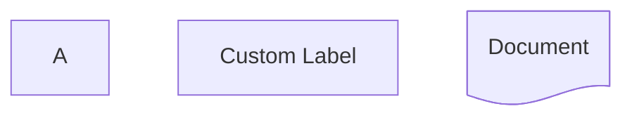
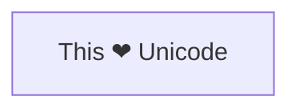
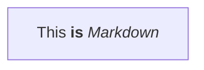
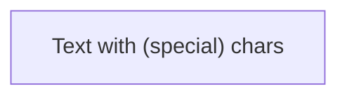

# FR-01: 新形状语法解析 & 文本增强

> 优先级: P0 | 状态: ✅ 完成

## 📋 概述

支持 Mermaid v11.3.0+ 引入的新形状语法 `@{ shape: xxx }` 和文本处理增强.

参考: [Mermaid Flowchart - Expanded Node Shapes](https://mermaid.js.org/syntax/flowchart.html#expanded-node-shapes-v1130)

---

## 🎯 需求

### 1.1 新形状语法解析 `@{}`

**语法格式:**


**支持的属性:**
- `shape` - 形状类型
- `label` - 节点文本
- `icon` - 图标 (延后)
- `img` - 图片 (延后)
- `form` - 形状变体 (延后)
- `pos` - 标签位置 (延后)
- `w` / `h` - 宽度/高度 (延后)
- `constraint` - 约束 (延后)

### 1.2 30+ 新形状类型

根据官方文档,新增以下形状的**解析支持** (渲染在 FR-03):

| 语义名 | 短名 | 别名 |
|--------|------|------|
| Process | rect | proc, process |
| Event | rounded | event |
| Terminal Point | stadium | terminal, pill |
| Subprocess | framed-rectangle | subprocess, fr-rect, subproc |
| Database | cylinder | cyl, db |
| Junction | filled-circle | filled, fc |
| Start | circle | circ |
| Stop | doublecircle | dblcirc |
| Decision | diamond | diam |
| Prepare | hex, hexagon | prepare |
| Data | lean-right | lean-r, in-out |
| Data | lean-left | lean-l |
| Priority Action | trapezoid | trap-t, priority |
| Manual Operation | inv-trapezoid | trap-b, inv-trap, manual |
| Manual File | flag | lin-doc |
| Manual Input | sloped-rect | sl-rect, manual-input |
| Display | curved-trapezoid | curv-trap, display |
| Document | document | doc |
| Lined Document | lined-document | lin-doc, lined-doc |
| Waved Document | wave-rect | waved-doc |
| Waved Edge | waved-lined | waved-rect |
| Card | notched-rectangle | notch-rect, card |
| Stored Data | bow-tie-rect | bow-rect, stored |
| Multi-Doc | stacked-document | docs, st-doc |
| Disk | lined-cylinder | lin-cyl, disk |
| Tinted Disk | capped-cylinder | cap-cyl, tinted |
| Loop Limit | trapezoid-pentagon | trap-pent, loop-limit |
| Collate | hourglass | collate |
| Delay | half-rounded-rect | delay, h-rounded |
| Comment | brace | comment |
| Brace | brace-r | |
| Braces | braces | |
| Lightning Bolt | bolt | lightning |
| Paper Tape | tag-rect | tagged |
| Odd | odd | |
| Triangle | triangle | tri |
| Window Pane | window-pane | win-pane |
| Divided Process | divided-rect | div-rect, div-proc |
| Lined Process | lined-rect | lin-rect, lin-proc |
| Fork/Join | fork | |
| Double Circle | dbl-circ | framed-circle |
| Cross in Circle | crossed-circle | cross-circ |
| Small Circle | sm-circ | small-circle |

### 1.3 文本处理增强

**Unicode 文本:**


**Markdown 文本:**


**引号文本去引号:**

解析后 `text` 应为 `Text with (special) chars`,不包含外层引号.

---

## 🔧 实现

### Parser 修改

**文件:** `src/core/parser/MermaidParser.ts`

1. 添加 `@{}` 语法正则匹配
2. 解析 JSON-like 属性
3. 引号文本去引号处理
4. 扩展 `ShapeType` 类型

```typescript
// 新形状语法正则
const NEW_SHAPE_PATTERN = /^(\w+)@\{([^}]+)\}$/;

// 解析新形状语法
private parseNewShapeSyntax(nodeStr: string): { id: string, shape: ShapeType, text: string } | null {
  const match = nodeStr.match(NEW_SHAPE_PATTERN);
  if (!match) return null;

  const id = match[1];
  const props = this.parseShapeProps(match[2]);

  return {
    id,
    shape: this.mapShapeName(props.shape) || 'rect',
    text: props.label || id
  };
}
```

### Model 修改

**文件:** `src/core/model/types.ts`

扩展 `ShapeType`:
```typescript
export type ShapeType =
  // 现有
  | 'rect' | 'rounded' | 'stadium' | 'subroutine' | 'cylinder'
  | 'circle' | 'doublecircle' | 'diamond' | 'hexagon'
  | 'trapezoid' | 'inv_trapezoid' | 'lean_right' | 'lean_left' | 'odd'
  // 新增
  | 'doc' | 'card' | 'delay' | 'hourglass' | 'bolt' | 'triangle'
  | 'window_pane' | 'divided_rect' | 'lined_rect' | 'fork'
  // ... 其他新形状
```

---

## ✅ 验收标准

### 解析测试

```typescript
it('解析新形状语法 @{ shape: doc }', () => {
  const model = parser.parse('flowchart TD\n  A@{ shape: doc, label: "Document" }');
  expect(model.getNode('A')?.shape).toBe('doc');
  expect(model.getNode('A')?.text).toBe('Document');
});

it('引号文本正确去引号', () => {
  const model = parser.parse('flowchart LR\n  A["Text with (parentheses)"]');
  expect(model.getNode('A')?.text).toBe('Text with (parentheses)');
});
```

---

## 📊 当前失败测试

来自 `MermaidParser.compat.test.ts`:

- ❌ `8.4 带引号的文本 (特殊字符)` - 引号未被正确去除

---

## 🔗 依赖

- 无前置依赖
- 被依赖: FR-03 (新形状渲染)
