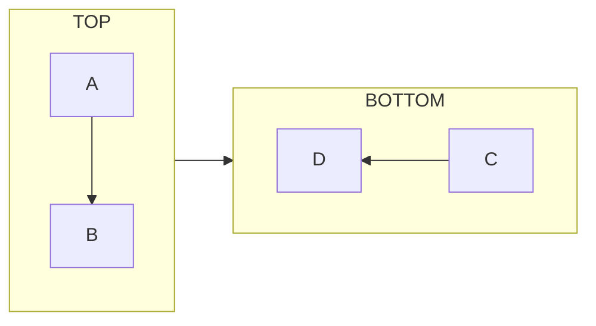
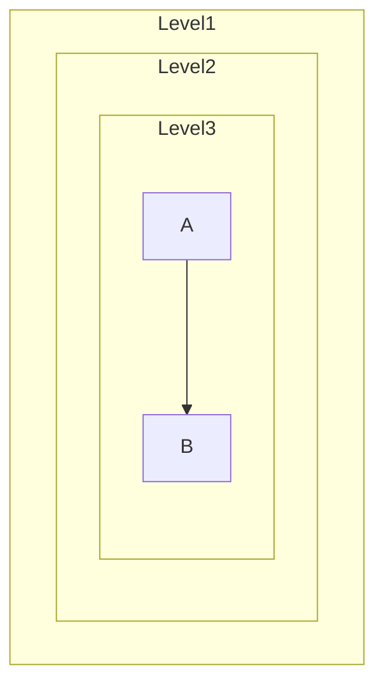
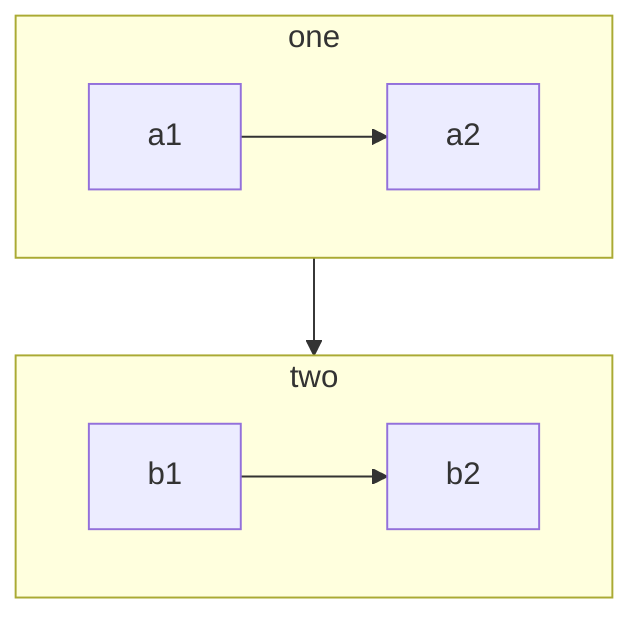

# FR-04: 子图增强

> 优先级: P2 | 状态: ✅ 完成

## 📋 概述

增强子图(Subgraph)功能,支持子图内方向、深层嵌套和子图间连边.

参考: [Mermaid Flowchart - Subgraphs](https://mermaid.js.org/syntax/flowchart.html#subgraphs)

---

## 🎯 需求

### 4.1 子图内方向

**语法:**


子图内可以声明独立方向,覆盖全局方向.

### 4.2 子图深层嵌套

**语法:**


支持 3+ 层嵌套子图.

### 4.3 子图间连边

**语法:**


子图本身可作为边的端点.

---

## 🔧 实现

### Parser 修改

**文件:** `src/core/parser/MermaidParser.ts`

```typescript
// 解析子图内的 direction 语句
private parseSubGraphDirection(line: string): Direction | null {
  const match = line.match(/^\s*direction\s+(TB|TD|BT|LR|RL)\s*$/i);
  return match ? (match[1].toUpperCase() as Direction) : null;
}
```

### Model 修改

**文件:** `src/core/model/SubGraph.ts`

```typescript
interface SubGraphData {
  id: string;
  title: string;
  nodeIds: string[];
  parentId?: string;       // 父子图 ID (嵌套)
  direction?: Direction;   // 子图独立方向
}
```

### Layout 修改

**文件:** `src/canvas/layout/DagreLayout.ts`

需要为嵌套子图分别创建子布局引擎,并应用各自方向.

---

## ✅ 验收标准

### 测试用例

```typescript
it('解析子图内 direction', () => {
  const model = parser.parse(`flowchart LR
    subgraph TOP
      direction TB
      A --> B
    end`);
  expect(model.subGraphs[0].direction).toBe('TB');
});

it('解析嵌套子图', () => {
  const model = parser.parse(`flowchart TB
    subgraph L1
      subgraph L2
        A
      end
    end`);
  const l2 = model.subGraphs.find(s => s.id === 'L2');
  expect(l2?.parentId).toBe('L1');
});

it('子图作为边端点', () => {
  const model = parser.parse(`flowchart TB
    subgraph one
      a1
    end
    subgraph two
      b1
    end
    one --> two`);
  expect(model.edges.find(e => e.source === 'one' && e.target === 'two')).toBeDefined();
});
```

---

## 📊 当前失败测试

来自 `MermaidParser.compat.test.ts`:

- ⏭️ `6.3 [待实现] 子图内方向` - 跳过

---

## 🔗 依赖

- 无前置依赖
- 关联: Canvas 渲染需要支持嵌套布局
